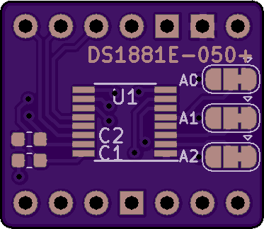
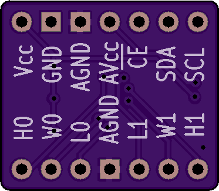

# DS1881-Breakout

A breakout board for the Dallas/Maxim i2c logarithmic potentiometer

#### [Hackaday.io Page](https://hackaday.io/project/167234-ds1881-breakout)

#### [Order from Tindie](https://www.tindie.com/products/17867/)

------------------------

### What is in this repository:

**./doc**:  Location for documentation

**./KiCAD**:  Hardware design files

**./Arduino**:  Arduino driver

------------------------

### Notes on driver features:

#### Preserving and restoring hardware states

The driver provides a means of cloning prior states to and from a buffer.
Possible reasons for doing this might be...

  * Higher bus efficiency during `init()`.
  * Major code savings, since you can skip configuring the hardware and the class with discrete function calls.

Saving the current state can be done like this (from the example sketch)...

    uint8_t buffer[DS1881_SERIALIZE_SIZE];
    uint8_t written = ds1881.serialize(buffer, DS1881_SERIALIZE_SIZE);
    if (DS1881_SERIALIZE_SIZE == written) {
      // Everything worked. Do what you will with the buffer.
    }

Restoring the state from a buffer can be done either upon construction...

    uint8_t buf[6] = { 0x01, 0x28, 0x00, 0x3F, 0x3F, 0x06 };
    DS1881 ds1881(buf, 6);

...or after a successful `init()`...

    // Literally anywhere in the sketch...
    ds1881.unserialize(buf, 6);

If done by construction, the configuration will be written to the class immediately,
and to the hardware during `init()`.

Invocation of `unserialize()` will immediately result in I/O as the new
configuration is imparted, but the fields (if any) that are otherwise required for
construction will be ignored.

------------------------

Front | Back
:-------:|:------:
  | 

